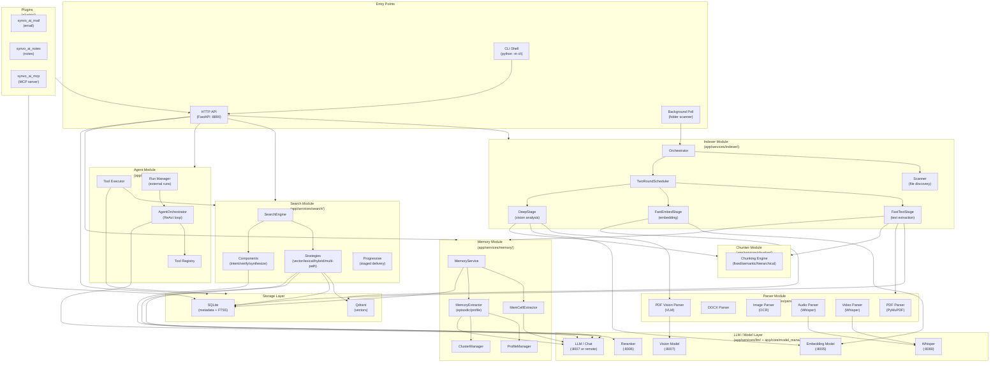
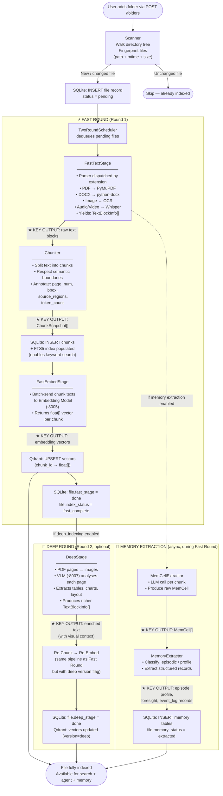
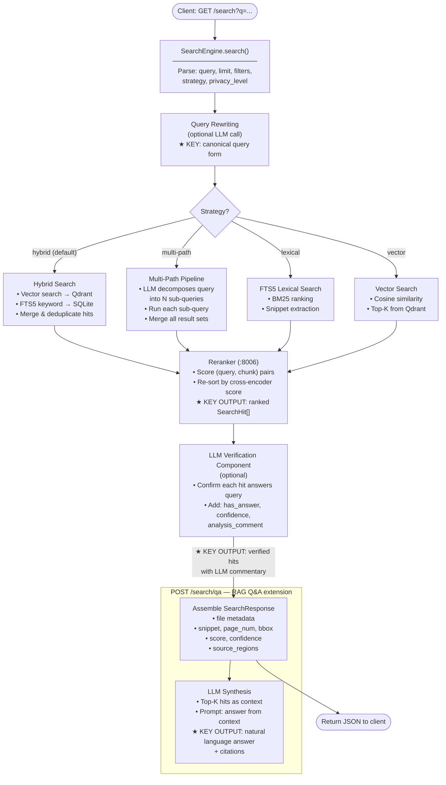
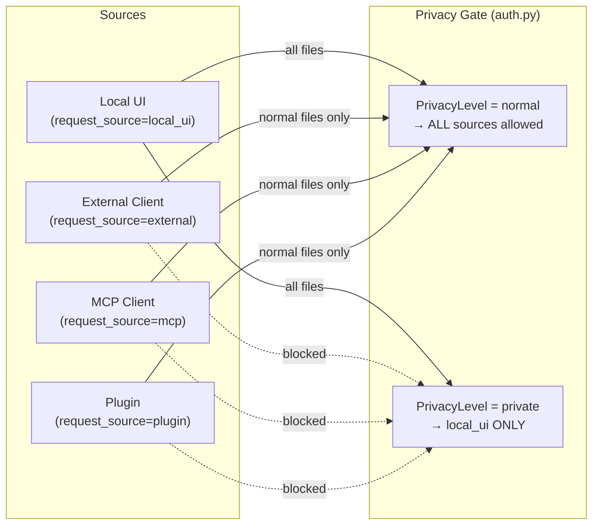

# Local Cocoa Service — Data Flow & Architecture

> Generated: 2026-04-09

---

## 1. System Overview

**Local Cocoa Service** is a FastAPI-based backend for a local-first AI document intelligence platform. It ingests files from watched folders, extracts and indexes their content, and exposes hybrid search, RAG Q&A, agentic reasoning, and memory extraction over the indexed corpus.

**Runtime stack:**

| Layer | Technology |
|---|---|
| HTTP server | FastAPI + Uvicorn (`127.0.0.1:8890`) |
| Metadata / FTS | SQLite (FTS5) |
| Vector store | Qdrant (local on-disk) |
| Embedding model | Qwen3-Embedding-0.6B (local HTTP, port 8005) |
| Vision model | Qwen3VL-2B-Instruct (local HTTP, port 8007) |
| Reranker | bge-reranker-v2-m3 (local HTTP, port 8006) |
| LLM / Chat | llama-cpp or remote (OpenAI / Anthropic / Gemini) |
| Speech-to-text | Whisper (local HTTP, port 8080) |

---

## 2. High-Level Module Map

```
┌─────────────────────────────────────────────────────────────────────────────┐
│                         LOCAL COCOA SERVICE                                  │
│                                                                               │
│  ┌──────────────┐  ┌──────────────┐  ┌──────────────┐  ┌──────────────┐    │
│  │   Indexer    │  │   Search     │  │    Agent     │  │   Memory     │    │
│  │  (Pipeline)  │  │  (Engine)    │  │ (Orchestrat) │  │  (Service)   │    │
│  └──────┬───────┘  └──────┬───────┘  └──────┬───────┘  └──────┬───────┘    │
│         │                 │                  │                  │             │
│  ┌──────▼──────────────────▼──────────────────▼──────────────────▼───────┐  │
│  │                         Storage Layer                                   │  │
│  │          SQLite (metadata + FTS5)  +  Qdrant (vectors)                 │  │
│  └────────────────────────────────────────────────────────────────────────┘  │
│                                                                               │
│  ┌──────────────┐  ┌──────────────┐  ┌──────────────┐  ┌──────────────┐    │
│  │   Parser     │  │   Chunker    │  │  LLM Client  │  │   Plugins    │    │
│  │ (Extractors) │  │  (Splitters) │  │ (Local/Remot)│  │(mail/notes/..)│   │
│  └──────────────┘  └──────────────┘  └──────────────┘  └──────────────┘    │
└─────────────────────────────────────────────────────────────────────────────┘
```

---

## 3. Module Boundaries



---

## 4. Data Flow — File Indexing Pipeline

This is the primary **data production** path. Raw files are transformed into searchable, retrievable knowledge.



---

## 5. Data Flow — Search Query



---

## 6. Data Flow — Agent (ReAct Loop)

```mermaid
flowchart TD
    A([Client: POST /agent/stream\n{ query, history }]) --> B

    B["AgentOrchestrator.run()\n• Build system prompt\n  (native tool-call or fallback)\n• Inject available tools list"]

    B --> C["LLM Call\n(local llama-cpp or remote)"]

    C --> D{Response type?}

    D -->|"Final answer"| END([Stream: final answer tokens\nstatus=done])

    D -->|"Tool call"| E["Tool Executor\n──────────────\nDispatch by tool name:"]

    E --> T1["workspace_search\n→ SearchEngine.search()\n★ KEY: retrieves relevant chunks"]
    E --> T2["workspace_qa\n→ Full RAG pipeline\n★ KEY: LLM-synthesised answer"]
    E --> T3["get_document_chunks\n→ Storage.get_chunks(file_id)\n★ KEY: raw text of specific file"]
    E --> T4["list_files\n→ Storage.list_files()\n★ KEY: corpus overview"]
    E --> T5["get_file_content\n→ File bytes download"]

    T1 & T2 & T3 & T4 & T5 --> F["Tool result appended\nto conversation context"]

    F -->|"Next iteration"| C

    subgraph STREAM["NDJSON Event Stream"]
        S1["thinking_step"]
        S2["tool_call"]
        S3["tool_result"]
        S4["token (answer chars)"]
        S5["status"]
    end

    C -.->|"stream events"| STREAM
```

---

## 7. Data Flow — Memory Extraction (Standalone)

```mermaid
flowchart TD
    A([POST /memory/extract\n{ file_id, user_id }]) --> B

    B["MemoryService\n• Load file chunks from SQLite\n• Apply chunking strategy\n  (original chunks or re-chunk)"]

    B --> C["For each chunk →\nMemCellExtractor\n(LLM call)\n★ KEY OUTPUT: MemCell\n{ original_data, summary,\n  timestamp, metadata }"]

    C --> D["MemoryExtractor\n• Classify MemCells\n• Run extraction prompts"]

    D --> E1["EpisodicExtractor\n★ KEY OUTPUT: EpisodeRecord\n{ title, summary, episode,\n  timestamp, participants }"]

    D --> E2["ProfileExtractor\n★ KEY OUTPUT: ProfileRecord\n{ topic, subtopic,\n  profile_info }"]

    D --> E3["EventLogExtractor\n★ KEY OUTPUT: EventLogRecord\n{ event, entities, timestamp }"]

    D --> E4["ForesightExtractor\n★ KEY OUTPUT: ForesightRecord\n{ foresight (prediction) }"]

    E1 & E2 & E3 & E4 --> F["ProfileManager\n• Merge/update existing profiles\n• ClusterManager groups\n  related memories"]

    F --> G["SQLite: INSERT/UPDATE\nepisodes, profiles,\nevent_logs, foresights tables\nfile.memory_status = extracted"]

    G --> END([POST /memory/search\nreturns relevant memories\nfor a given user + query])
```

---

## 8. Key Information Production Summary

The table below lists every point in the system where **new structured knowledge** is synthesised or generated — the "value-add" transformations.

| # | Stage | Input | ★ Key Output | Where Stored |
|---|---|---|---|---|
| 1 | **FastTextStage** | Raw file bytes | `TextBlockInfo[]` — page-aware text blocks | in-memory only |
| 2 | **Chunker** | TextBlockInfo[] | `ChunkSnapshot[]` — semantic text units with spatial coords | SQLite `chunks` + FTS5 index |
| 3 | **FastEmbedStage** | Chunk texts | Float vectors (dense embeddings) | Qdrant |
| 4 | **DeepStage (VLM)** | PDF page images | Enriched TextBlockInfo with visual context (tables, charts) | in-memory → re-chunked → Qdrant |
| 5 | **Whisper transcription** | Audio / video | Transcript text | fed into Chunker → SQLite + Qdrant |
| 6 | **Query rewriting (LLM)** | Raw user query | Canonical / expanded query | in-memory only |
| 7 | **Multi-path decomposition (LLM)** | Single query | N sub-queries covering different aspects | in-memory only |
| 8 | **Reranker** | (query, chunk) pairs | Relevance scores → sorted `SearchHit[]` | returned in response |
| 9 | **Verification component (LLM)** | Query + top hits | `has_answer`, `confidence`, `analysis_comment` per hit | returned in response |
| 10 | **RAG synthesis (LLM)** | Top-K chunks as context | Natural language answer + citations | returned in response |
| 11 | **Agent ReAct loop (LLM)** | User task + tool results | Iterative reasoning trace + final answer | streamed + (optionally) stored in chat |
| 12 | **MemCellExtractor (LLM)** | Document chunk | `MemCell` — distilled atomic fact | in-memory |
| 13 | **EpisodicExtractor (LLM)** | MemCells | `EpisodeRecord` — time-bound event with participants | SQLite `episodes` |
| 14 | **ProfileExtractor (LLM)** | MemCells | `ProfileRecord` — durable user/entity trait | SQLite `profiles` |
| 15 | **EventLogExtractor (LLM)** | MemCells | `EventLogRecord` — structured event entity | SQLite `event_logs` |
| 16 | **ForesightExtractor (LLM)** | MemCells | `ForesightRecord` — predictive insight | SQLite `foresights` |
| 17 | **Whisper (audio/video)** | Audio stream | Transcript with timestamps | fed into indexing pipeline |
| 18 | **Scanner (file fingerprint)** | File system stat | Dedup hash (path+mtime+size) | SQLite `files` |

---

## 9. Inter-Process Communication

All ML inference is performed by separate processes exposed as HTTP services. The main FastAPI process is thin — it orchestrates, not infers.

```
┌─────────────────────────────────────────────────────────┐
│             Main FastAPI Process (:8890)                 │
│                                                           │
│  Indexer ──HTTP──► Embedding Model      :8005            │
│  Parser  ──HTTP──► Vision Model (VLM)   :8007            │
│  Search  ──HTTP──► Reranker             :8006            │
│  Agent   ──HTTP──► LLM / Chat           :8007 (or remote)│
│  Parser  ──HTTP──► Whisper              :8080            │
│                                                           │
│  All services ──► SQLite       (file-local)              │
│  All services ──► Qdrant       (file-local)              │
└─────────────────────────────────────────────────────────┘
```

Remote providers (OpenAI, Anthropic, Gemini, DeepInfra) replace the local ports when configured. Settings are persisted to `<runtime>/provider_config.json` and live-reloaded.

---

## 10. Privacy Boundary



`PrivacyLevel` is set at folder or file level and inherited by every `ChunkSnapshot` — the gate is enforced inside both SQLite queries (FTS5 search) and Qdrant vector filters.

---

## 11. Plugin Data Boundary

Each plugin runs with an isolated SQLite schema (prefixed tables) and registers its own FastAPI router. Plugins can call back into core services (storage, LLM client) but core services never import from plugin code — the dependency arrow is one-directional.

```
plugin (synvo_ai_mail)
    ├── plugin.json          — manifest
    ├── router.py            — registers /mail/* routes
    ├── storage.py           — prefixed SQLite tables (mail_*)
    └── service.py           → imports app.core.*  (one-way)
                             → imports app.services.storage.*
                             ✗ app/ never imports plugins/*
```

---

*End of document.*
